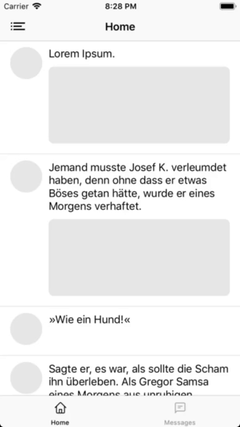
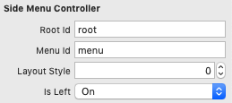

# JESideMenuController
[](https://travis-ci.org/jaeilers/JESideMenuController) [](https://codecov.io/gh/jaeilers/JESideMenuController)     

The `JESideMenuController` is a custom container controller that manages a side menu and the currently selected content. It supports different styles such as: slide-out, slide-in (navigation drawer) and slide-out the menu and content simultaneously. This controller supports storyboards, initialization via code and is Safe Area compatible.

## Features

- [x] Styles: slide-out, slide-in, slide-out inline (slide out the menu and content at the same time)
- [x] Left or right side
- [x] Storyboards & code
- [x] Portrait & landscape
- [x] iPhone & iPad support
- [x] Safe Area support

slide out | slide in | slide out inline
--- | --- | ---
 |  | 

## Requirements
- iOS 10.0+
- Xcode 10.2+
- Swift 4.2+

## Installation

### CocoaPods
To integrate the `JESideMenuController` in your project, add the following line to your `Podfile`:

```
  pod 'JESideMenuController', '~> 1.0.0'
```

### Carthage
[Carthage](https://github.com/Carthage/Carthage) is a decentralized dependency manager. To integrate the `JESideMenuController` add the following line to your `Cartfile` and follow the instructions to [add the framework to your application](https://github.com/Carthage/Carthage#adding-frameworks-to-an-application):

```
github "jaeilers/JESideMenuController" ~> 1.0.0
```

### Swift Package Manager
[Swift Package Manager](https://github.com/apple/swift-package-manager) is the official dependency manager for Cocoa projects. Xcode 11 directly integrates Swift PM. Add the url of this repository to your dependencies in Xcode or add the following line to your `Package.swift` as a value in `dependencies`:

```
dependencies: [
	.package(url: "https://github.com/jaeilers/JESideMenuController.git", from: "1.0.0")
]
```

## How to use

### Set-up via Code

Upon initialization the `JESideMenuController` needs a reference to your menu view controller, which will allow choosing a different view controller for the displayed content, and the root view controller, which will be displayed as the first view controller at launch.

```swift
let menuViewController = ...
let rootViewController = ...
let sideMenuController = JESideMenuController(rootViewController: rootViewController,
                                              menuViewController: menuViewController)
...
```

The default values are a slide-out on the left side. To choose a different configuration use the following constructor signature:

```swift
...
let sideMenuController = JESideMenuController(rootViewController: rootViewController,
                                              menuViewController: menuViewController,
                                              style: .slideIn,
                                              isLeft: true)
...
```

The following constants of `JESideMenuController.Style` are available as arguments for the style parameter: `.slideOut`, `.slideIn`, `.slideOutInline`. Left and right position are available for all styles.

### Storyboards

Set the `JESideMenuController` as your root view controller in your `Main.storyboard` and set-up a menu (table) view controller and a root view controller. Add the Storyboard identifiers as values to the user defined runtime attributes `menuId` and `rootId` in `JESideMenuController`. They are also available as inspectable attributes. To configure the position (left/right), enter a boolean value in the inspectable attribute `isLeft`. Default is `true` for a left side menu. To adjust the style of the slider, enter a number (0...2) in `Layout Style`:



- 0: slide-out
- 1: slide-in
- 2: slide-out inline (twitter style)

For more information, refer to the example project.

### API - JESideMenuController

You can access the `JESideMenuController` instance due to a `UIViewController` extension. 

```swift
public var sideMenuController: JESideMenuController? { get }
```

#### Enabled/disable scrolling
```swift
public var isScrollEnabled: Bool { get set }
```

#### Set a new view controller and hide the menu
```swift
/// Set and display a new root view controller and hide the menu (animated).
public func setViewController(_ viewController: UIViewController, animated: Bool)

// Example:
let newViewController = ...
sideMenuController?.setViewController(newViewController, animated: true)
```

#### Toggle the state of the menu
```swift
/// Hides or reveals the menu based on the current state.
public func toggle(animated: Bool = true)

// Example:
sideMenuController?.toggle()
```

#### Set the state of the menu
```swift
/// Set the hidden state of the menu. Optionally animated.
public func setMenuHidden(_ isHidden: Bool, animated: Bool)

// Example:
sideMenuController?.setMenuHidden(true, animated: true)
```

#### Determine the state of the menu
```swift
public var isMenuVisible: Bool { get }

// Example:
sideMenuController?.isMenuVisible
```

## License
This framework is released under [MIT License](./LICENSE.md). All icons featured in the example project are part of [80 UI outlined icons](https://www.sketchappsources.com/free-source/3841-ui-outlined-icons-sketch-freebie-resource.html) and were created by *Kit of Parts*, &copy; 2019 [kitofparts.co](http://kitofparts.co/)